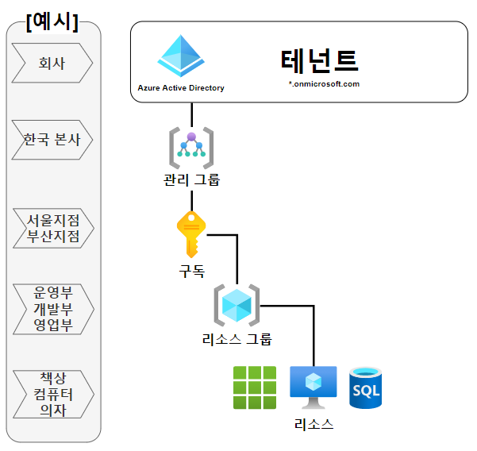

# Azure Architect

1일차

# Azure 프리티어 계정

- 강의 정리는 아니고 한달동안 200 크레딧을 주고 1년 프리 티어인데 학생 계정으로 하면 따로 100크레딧 1년짜리를 추가로 주고 프리 티어 사용량도 또 더 준다.

- 학생 계정은 Azure 내에서 Education 서비스를 들어가서 그 안에서 사용한다.

# Azure 지오그래피

- 지오그래피 -> Regional Pair -> Region -> AZ

- Regional Pair가 AWS 리전과 같은 범위인 것 같고 Korea Region Pair가 있다. 그 안에 복수의 Region이 있고 그 안에 복수의 AZ가 있다.

- 복수의 Region은 하나는 Sub로 있고 백업 용도로 쓰이는 듯 하다.

- Korea Central(서울), Korea South(부산)

- 그럼 Regional Pair는 단순히 계층을 하나 더 추가한 개념으로 보는 것이 맞을 것 같다.

# Azure 구독, 리소스 그룹, 리소스

- 리소스 그룹을 삭제하면 그 안에 있는 리소스도 한번에 삭제되므로 리소스 라이프 사이클 관리가 용이하다.

- 

- https://support.bespinglobal.com/ko/support/solutions/articles/73000544876--azure-azure%EC%9D%98-%EA%B5%AC%EB%8F%85-%EA%B0%9C%EB%85%90%EC%9C%BC%EB%A1%9C-%EC%95%8C%EC%95%84%EB%B3%B4%EB%8A%94-%EB%A6%AC%EC%86%8C%EC%8A%A4-%EA%B4%80%EB%A6%AC

- 일단 간단하게는 리소스 그룹을 만들어서 그 안에 리소스를 운영하면 된다.

# Azure Network Service (Azure Virtual Network)

- Azure Vnet은 AWS VPC와 같은 개념이다.

- Vnet은 구독 -> 리소스 그룹에 생성된다. 구독을 선택하고 그 구독 안에 리소스 그룹을 선택해서 그 안에 Vnet을 생성한다.

- Azure Bastion, Azure Firewall, Azure DDoS 사용 옵션을 체크할 수 있다.

- Azire NSG(Network Security Group) - AWS NACL과 비슷한 네트워크 보안 리소스이다. 우선순위, 허용, 거부 규칙이 있다.

- 그 다음 네트워크의 IP 대역과 서브넷을 구성한다. 서브넷에 가용 영역 선택이 없고 퍼블릭 서브넷, 프라이빗 서브넷을 결정하는 것도 옵션을 체크하면 된다.

# DNS 영역

- AWS Route 53의 호스팅 영역과 동일하다.

- 생성할 리소스 그룹을 명시하고 아래 이름 항목에 사용할 도메인을 입력한다.

- 구매한 도메인 회사의 내 도메인 설정에 Azure DNS의 네임 서버를 입력한다.

- 네임 서버 정보를 확인하기 위해 `nslookup -type=ns [도메인]`을 사용해서 확인한다.

- 이후 똑같이 리소스를 생성하고 레코드를 기입해서 부여하면 된다.

- 별칭의 활용도 똑같이 가능하다. Azure의 별칭은 VM 인스턴스에 부여된 Public IP도 가리킬 수 있다.

# Azure VM

- EC2같은 서버 인스턴스를 의미한다.

- 템플릿(AMI)에 기반한 생성도 똑같이 가능하다.

- 서브넷은 가용 영역을 정하지 않았지만 서버를 생성할 때는 가용 영역을 선택한다.

- 보안 유형에서 신뢰할 수 있는 VM은 VM에 몇가지 보안 관련 툴이 설치된다는 것 같다.

- VM의 Default User는 `azureuser`이다.

- 이미지는 CentOS-based - 무료, Ubuntu 20.xx - 무료, 그외 여러 Windows - 무료

- 스팟 인스턴스 처럼 Azure Spot이라는 할인 옵션이 있는데 VM을 생성할때 선택할 수 있다.

- 키 페어를 생성하거나 할당할 수 있다. 다른 클라우드에서는 권장되지 않지만 암호를 통한 SSH도 선택지가 있다.

- VM 이미지 중에 리눅스도 Minimal이 아닌 경우가 있는 것 같다. Minimal인지 GUI인지 확인하자.

- 이미 생성된 NSG를 선택하려면 네트워크 인터페이스에서 고급을 선택해서 NSG를 적용하면 된다.

## Private vs Public

- AWS처럼 엄격한 구분이 아니라 공인 IP를 부여 할지 말지로 단순히 결정해서 임의로 나누는 듯 하다.

## 권장 경고 규칙 설정

- SNS + CloudWatch를 옵션 체크 하나로 설정할 수 있다. 이건 큰 장점으로 보인다. 임계값 설정과 메일 알림 가능

## 부트 진단

- 속도가 좀 느려지는데 이 부분을 고려해서 할지말지 결정하는 듯 하다. 빨라야 하면 체크 x

## 사용자 지정 데이터 및 Cloud-init

- AWS EC2의 User Data와 동일하다. 인스턴스 시작할 때 스크립트를 실행한다.

# Azure Disk Storage

- VM에 붙는 기본 블록 스토리지 디스크이다.

- 디스크에 데이터를 암호화해서 읽고 쓰는 옵션이 있고 그 암호화와 관련된 키를 설정할 수 있다.

- 추가 디스크를 생성할 수 있는데 VM의 디스크 항목에서 바로 추가가 가능하다.

- 추가 디스크를 공유 속성을 부여해서 생성할 수도 있는데 이 디스크를 여러 VM이 공유 파일 시스템처럼 동시에 마운트된 상태로 사용할 수 있다. Azure만의 서비스이다.

- VM안에서 lsblk 명령어를 사용하면 OS가 설치된 루트 볼륨 sda 외에 sdb라는 이름의 서비스 디스크가 있고 추가 디스크를 설정했다면 추가 디스크도 확인할 수 있다.

# 할당량

- Azure에서 AWS에서 EIP가 5개로 한정되는 것과 같이 할당량이라는 항목에서 리소스 할당량(제한)을 확인할 수 있다.

- Azure는 공인 IP가 기본적으로 3개가 상한선이다.

# NSG

- NSG는 NACL과 같이 동작하는 보안 그룹으로 인스턴스에 적용된다.

- 기본값이 내부 인바운드는 모두 허용이므로 ICMP를 허용하지 않더라도 같은 NSG를 적용한 VM끼리는 서로 ping이 나간다.

# Windows 가상 디스크

- 윈도우 PC에서 생성한 가상 디스크를 Azure Windows Server VM에 마운트 시킬 수 있다.

# 부하 분산 장치

- 로드밸런서를 의미한다.

- 인터넷 경계와 내부처럼 공개와 내부로 설정해서 생성할 수 있다.

- 생성 과정은 조금 더 직관적이다.

- l4를 외부로 설정했으니 할당할 공인 IP를 설정하고 백엔드 풀을 형성하는데 그 안에 담길 VM을 선택한다.

- 그다음 직접 인바운드, 아웃바운드 룰을 설정한다. 부하 분산 규칙에 로드밸런서가 트래픽을 받을 리스너를 설정하고 백엔드 풀에서 받을 포트를 설정한다.

- 인바운드 NAT 규칙은 LB의 IP에 포트를 명시해서 접속하면 그 포트를 맵핑된 포트로 포워딩하는 기능이다.

- `123.123.123.123:8080`으로 LB에 접속하면 뒷단 VM의 `10.0.0.0/8080`으로 한다는건가? 아니면 다르게도 할 수 있는건가

- 아웃바운드 규칙은 아래 SNAT랑 비슷한 의미인 듯 하다.

- 기본 규칙이 RR은 아닌 듯 하다. 해시 방식이라고 한다.

## 상태 프로브

- 상태 검사를 하는 개체로 명시된 내용을 저장한다.

- LB 부하 분산 규칙에서 그 개체를 선택한다.

## 아웃바운드 SNAT 옵션

- 로드밸런서와 연결된 백엔드 풀의 VM에서 외부로 나가는 트래픽이 허용되도록 하는 옵션이다.

- 프라이빗이더라도 인터넷 엑세스가 가능해진다.

- 근데 엔트리 포인트가 되는 LB이고 3-tier이고 연결된 WS가 프라이빗인 경우가 아니라면 딱히?

